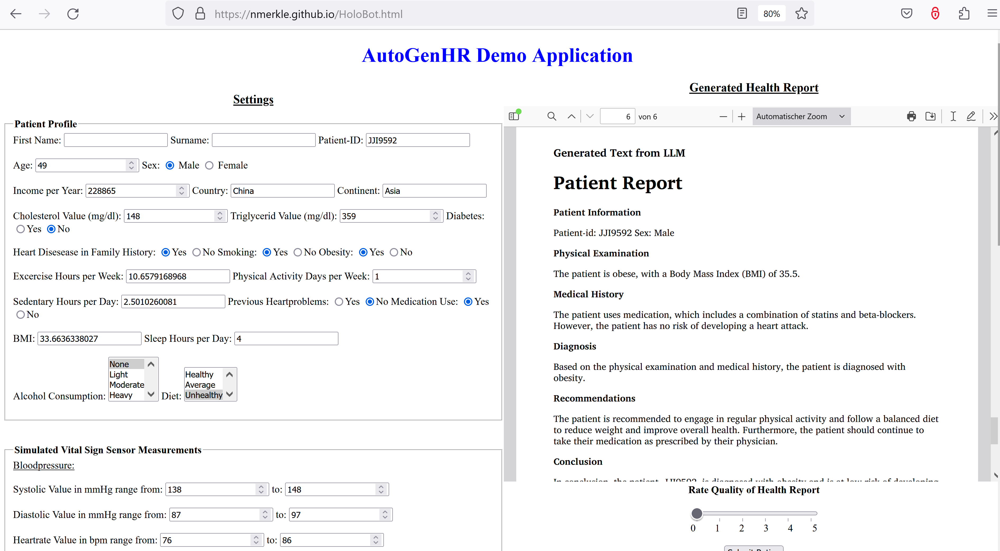
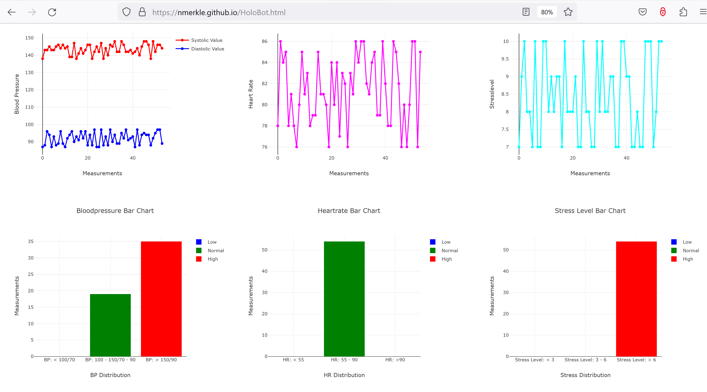

# Demo Application - AutoGenHR 
The **[Web Demo Application](https://nmerkle.github.io/HoloBot.html)** demonstrates the purpose of ***AutoGenHR***, an application that allows the automated generation of health reports. 

# Important note
The application runs free of charge on the **[Render](https://render.com/pricing)** platform, which of course imposes certain restrictions on its use. For instance, it may happen that no web socket connection 
can be established in the first few minutes, even after multiple refreshes of the web browser, as the cloud server shuts down after a while and takes some time to restart after a client request. 
This may give the impression that the application is not working. In such situations, it helps not to give up immediately and to exercise patience. By reloading the application several times, you can ensure that 
the connection to the render server can be established. Unfortunately, this is the disadvantage of using free offers. If the platform will go in production, this will be fixed by other chargeable solutions. However,
for the purpose of demonstrating the idea, I decided to take a free of charge webservice. 

# Some impressions of the web demo application



On the left side patient profile information is provided. By clicking the button ```init random patient data``` new samples are randomly selected. As soon as the patient data is initialised, 
the ```Submit Data for Generating a health report``` the simulation of vital sign progression is conducted. Below the corresponding plots are rendered in real-time. After the configured steps of simulation,
the rendering of plots stops and the data is transmitted to the websocket server. There health report is generated based on the measured data and by means of the language model. However, currently it is not 
implemented in the intended way, see also information in the corresponding SEMANTICS paper.


